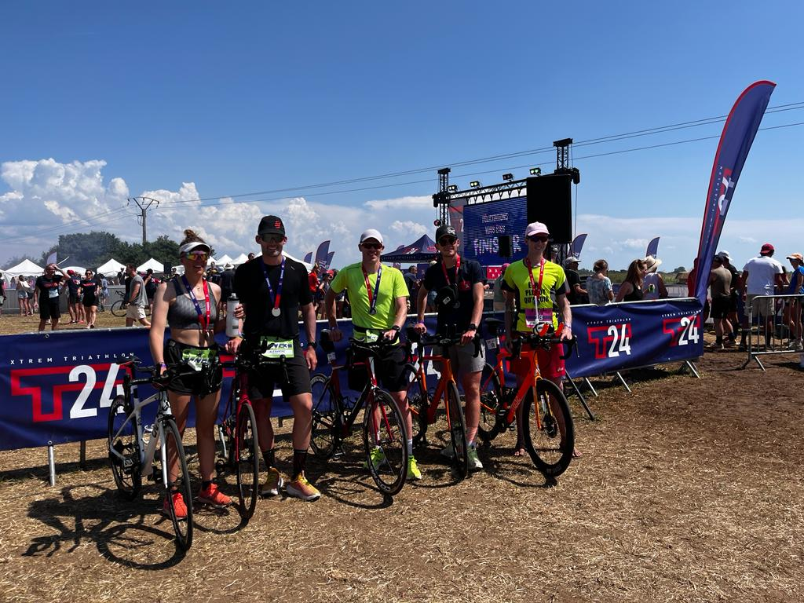

:swimming_man: :biking_man: :running_man: **Triathlon T24 Île de Ré** :swimming_man: :biking_man: :running_man:

Triathlon au format un peu particulier puisqu'il se décompose en 4 heures de natation, 12 heures de vélo et 8 heures de course à pieds.

La prépa a été compliquée étant donné que j'ai été plâtré 2 mois en début d'année suite à une méchante fracture du coude, et que j'ai ensuite dû ~reprendre~ commencer l'entraînement très progressivement avec la rééducation. Être sur la ligne de départ représente déjà une victoire et me procure déjà une grande satisfaction. Je ne viens pas dans l'objectif de pousser mon corp à bout mais pour savourer la possibilité de participer à cette nouvelle aventure.

Le départ est à 15 heures, il fait 30 degrés à l'ombre, l'attente sur la plage en plein cagnard avec la combinaison en néoprène est longue, tout le monde dégouline de sueur. Top départ ça y est c'est parti pour 24 heures ! La boucle fait 1 kilomètre, avec une sortie à l'australienne (sortir de l'eau, courir sur le sable, passer sous l'arche, et retourner à l'eau). Comme d'habitude avec l'excitation de la course je pars un peu trop vite, je termine la première boucle en 18 minutes. Je ralentis les tours d'après et je nage les 3 premiers kilomètres en une heure, exactement comme dans mes plans, impeccable. L'eau est ultra transparente, un régal. 4ème tour, je me dis que ça va être long car je commence déjà à avoir froid. L'eau est à 18 degrés ce qui en soi est très correct, mais ma combi est possiblement devenue une passoire thermique au fil des années, il va falloir penser à rénover. 5ème tour, c'est le début de la descente aux enfers, je suis frigorifié en nageant. À la fin de la boucle je décide de faire une longue pause pour me réchauffer et de ne pas repartir tant que je ne suis pas en sueur. Je m'assois sur le sable en plein cagnard. 20 minutes plus tard je claque toujours des dents, incroyable. Je laisse tomber l'idée de réussir à me réchauffer et je me force à repartir pour un tour. J'ai tellement froid, c'est horrible. Je commence à me faire une raison, je n'atteindrai pas mon objectif de nager 10 kilomètres, et je me fixe un nouvel objectif de 8 kilomètres. Nouvelle pause après le 6ème tour. Je suis encore assez bien physiquement alors je décide de mettre du rythme dans le 7ème tour pour essayer de me réchauffer. Ça fonctionne un peu, mais le courant s'est levé, et la grande ligne droite de la boucle se fait à contre courant, les bouées se rapprochent tellement lentement, c'est interminable. D'un seul coup, douleur vive sur toute la joue gauche : je me suis pris une méduse en tournant la tête pour respirer. Ça brûle, mais l'avantage c'est que ça me fait oublier le froid. Je fais des bonds dans l'eau en esquivant d'autres méduses, qui sont de sortie et viennent se joindre à la fête. Après le 7ème tour j'en ai vraiment marre de cette natation, entre le courant, le froid et les méduses, je n'ai qu'une envie c'est d'arrêter ce supplice, mais je me force quand même à partir pour un dernier tour, qui sera très très long. 8 kilomètres de natation, après une fracture du coude quelques mois plus tôt, je suis super content, c'est la première fois que je nage cette distance. Ce n'est que partie remise pour les 10 kilomètres !

Il y a 1 kilomètre pour retourner au parc à vélo. Je prends tout mon temps et je marche, je savoure la sensation du corps qui se réchauffe petit à petit. Je me change tranquillement et à 19h30 je me mets en selle, c'est parti pour le vélo ! Les premières heures la boucle fait 23 kilomètres, puis elle passe à 16 kilomètres. Je décide de rouler un maximum tant qu'il fait jour. Le parcours est sympa, je me sens en forme, je profite. C'est frustrant de se faire doubler par les personnes qui font le triathlon en relai mais il faut que je gère mon effort, la nuit va être longue. Une fois qu'elle est tombée la route n'est pas éclairée et seule la lampe à l'avant permet de voir quelques mètres devant soi. C'est fatiguant car il faut être hyper concentré pour ne pas rater un nid de poule ou un dos d'âne, et vraiment pas intéressant car le seul paysage se résume à une lumière qui éclaire un bout de goudron. Après 5 tours je suis toujours bien physiquement mais j'en ai marre, je décide de faire une pause. Je m'arrête après 106 kilomètres à 30 km/h. Il est minuit, Chloé (ma sœur), mon accompagnatrice pour cette épreuve, me dit avec joie que j'ai déjà fait un tiers de la course. Oua seulement un tiers, j'ai l'impression d'avoir commencé il y a tellement longtemps déjà. Elle m'a préparé le campement pour dormir, des petits sandwichs et d'autres gourdes pour repartir, un grand merci à elle pour toute son aide et pour tout son soutien tout au long de la course :heart: Je décide de dormir jusque 2h. 0h30 impossible de fermer l'œil, je décale le réveil à 2h30. C'est très difficile de trouver le sommeil, mais je pense avoir réussi à dormir 30 minutes, c'est toujours ça de pris. Je n'ai pas envie d'y retourner, il fait nuit et je sais que ça va être chiant. Je me fixe comme objectif de faire plus de 200 kilomètres et ce sera bien. Il me reste donc 7 boucles à effectuer. Je vais faire ça en 2 fois avec une petite pause au milieu, avoir un objectif intermédiaire est assez motivant et ça me permettra de prendre un petit repas. Je me remets en selle, c'est reparti. Grosse question, 3 tours puis 4 tours, ou 4 tours puis 3 tours ? Je boucle ( :smile: ) sur le sujet en roulant, ça m'occupe, et je décide de faire 3 tours, pause, puis 4. Cela me permettra de rouler plus longtemps avec la lumière du jour, qui se lèvera dans quelques heures. Durant le 3ème tour je rentre dans un état de trance, je ne sais plus où j'habite, j'enchaîne les kilomètres et je me sens bien, si bien que je continue avec un quatrième tour. Finalement ce n'est pas si mal la nuit. Durant ce 4ème tour, 2 choses magnifiques se produisent : la première c'est que je réalise que je me suis planté dans mes calculs et qu'il me faut en fait 6 boucles et pas 7 pour faire plus de 200 kilomètres, ce qui veut dire qu'il ne me reste plus que 2 boucles après ce tour, c'est la fête, je pousse la chansonnette sur mon vélo. La deuxième c'est que les oiseaux commencent à chanter, un vrai bonheur, le jour pointe le bout de son nez. Petite pause 20 minutes où je mange une grosse portion de salade de pâtes et c'est reparti pour les 2 derniers tours. Le jour étant maintenant levé, je vois bien devant moi et je peux remettre du rythme, un vrai régal ! Je suis rejoint sur l'autoroute la départementale du bonheur par mon cousin Bastien (qui fait le triathlon en relai avec ma sœur Clémence, mon beau-frère Alex et son petit frère Simon), on roule un peu ensemble et on partage une belle portion de route la tête dans les prolongateurs. Dernier tour, cette fois c'est avec Simon que je partage un bout de la boucle, trop content. Je pose le vélo un peu avant 7h, après 203 kilomètres, youpi !

Petit temps calme 20 minutes puis j'enfile mes sandales, qui feront le plus grand bonheur des speakers à chaque tour. 7h30 c'est parti pour la course à pieds ! La boucle fait 7 kilomètres. Je suis bien en jambe et étrangement je ne me sens pas très fatigué. Mais malheureusement je sais déjà que je ne pourrai pas faire une bonne course, cela fait quelques mois que je traîne un syndrome de l'essuie glace (tendinite au niveau du genou), qui provoque une vive douleur après un certain temps. Mon objectif principal est de réussir à courir un marathon avant que la douleur ne m'en empêche. Après 10 kilomètres, je décide d'alterner 1 kilomètre de course et 1 minute de marche. Cette stratégie me permet de repousser l'échéance jusqu'au 25ème kilomètre, après lequel il m'est impossible de courir. C'est très frustrant car la course à pieds est normalement mon point fort et j'en ai encore sous le pied pour enchaîner les tours. Mais c'est comme ça il n'y a rien que je puisse y faire sur le moment, tout ce que je peux faire c'est me réjouir de ce que j'ai plutôt que me focaliser sur ce que je n'ai pas, comme toujours. Je fais donc les 15 derniers kilomètres du marathon en marchant, ce qui me permet de discuter avec d'autres triathlètes qui marchent aussi et de faire de belles rencontres. Au dernier tour je traîne au ravito et Maryline et Bernard, avec qui je me suis bien marré à chaque tour, me paient une bière, ça devient bon !

8 kilomètres de nage, 203 kilomètres en vélo et un marathon. Je ne suis pas hyper emballé par ces chiffres mais je n'avais pas vraiment d'objectif, si ce n'est savourer cette aventure, ce que j'ai fait, un régal, surtout de pouvoir partager ça en famille !

:earth_asia: [Site web](https://www.t24-xtremtriathlon.com/t24-ile-de-re-2023) :earth_asia:

:stopwatch: [Résultats](https://www.klikego.com/specific/t24/resultats-challenge.jsp?reference=1603485341795-5&category=IND) :stopwatch:

