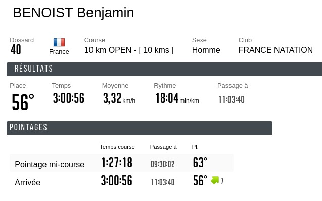

:swimming_man: **10 km eau libre Nice** :swimming_man:

L'été ayant été bien rempli, je commence ma prépa un peu tard. Pour rattraper le coup, je fais du gros volume pendant les 4 semaines qui précèdent la course, avec minimum 5 séances d'entraînement par semaine, plusieurs semaines à plus de 20km, et une ultime séance de 8.6km (canette) à 1 semaine de la course, dans une piscine, soit 172 longueurs, complètement abrutissant :joy: Après cette séance, je me sens prêt physiquement et je suis confiant sur mes capacités de nager les 10km en-dessous des 3h30, la barrière horaire.

Tout va pour le mieux dans le meilleur des mondes donc, ma prépa est terminée, je me sens chaud et j'ai hâte d'y être. Le plus compliqué ce n'est jamais la course, ce sont toujours les semaines d'entraînement qui la précèdent, où il faut enchaîner les séances et souvent faire des sacrifices pour que ce soit possible. Le jour J il n'y a plus qu'à prendre un maximum de plaisir.

Le week-end précédant la course, je me rends à un anniversaire avec des olympiades, dont un magnifique ventriglisse artisanal dans un champ avec une bâche. Tout excité je cours et je saute pour atterrir sur le ventre et glisser le plus vite possible. Et là c'est le drame, très grosse douleur au niveau des côtes, je ne peux plus respirer fort et certains mouvements me font terriblement mal.

Je pars pour Nice le lundi (la course étant le dimanche), j'ai un programme très précis pour la semaine de course, mis au point avec mon coach Guy. Mais les jours passent et la douleur ne diminue quasiment pas. Je fais quelques tests de natation mais c'est très compliqué, ne pouvant pas respirer fort et la respiration étant la base de la natation. Je peux forcer sur la douleur et nager, mais je ne suis pas du tout serein à l'idée de faire ça sur 10km, de peur de faire une bêtise. La douleur n'est qu'une information certes, mais si j'ai une côte fêlée c'est une information qu'il serait peut-être bon de prendre en compte. La veille de la course, je me rends aux urgences, je me fais osculter et passe une radio. À priori il n'y aurait pas fêlure mais seulement contusion, pas de risque pour les poumons et pas de contre-indication du médecin pour participer à la course. Ça m'enlève un énorme poids psychologique, je vais pouvoir nager sans risque, même s'il faut serrer les dents.

Le réveil à 5h45 pique et comme à chaque fois je me demande pourquoi je m'inflige ça. Je me force à prendre un petit déj, je me prépare, et direction le grand bleu ! Les conditions sont idéales, mer calme, eau à 23 degrés, grand ciel bleu, on aurait presque hâte que ça commence ! Je discute avec quelques nageurs.euses, l'ambiance est plutôt relax. Nous ne sommes que 91 à prendre le départ sur le 10km. Il y a aussi des courses de 5km, 2km, 1km et 500m qui partent un peu plus tard.

Le départ se fait depuis la plage des Ponchettes en face du vieux Nice, il faut ensuite nager 5km en longeant la promenade des anglais (à 300m du bord), sortir de l'eau pour l'unique ravitaillement, puis refaire les 5km dans l'autre sens.

8h03 top départ ! Grosse appréhension sur les premiers mètres car ils me donneront une indication de la douleur pour la course au niveau des côtes. Ça fait mal et c'est très gênant, mais ça ne m'empêche pas de nager normalement, c'est déjà ça, je suis hyper content et je savoure ce début d'une nouvelle aventure. Je décide de faire le premier 5km assez relâché pour voir comment la douleur évolue et j'aviserai au demi-tour. Rapidement le groupe s'étire. Je me retrouve souvent à nager à côté d'une fille qui semble avoir exactement le même rythme que moi. Je vois qu'elle lève très souvent la tête pour s'orienter, je me dis super, je décide de ne plus le faire et de me fier à elle. Nous nageons côte à côte, je regarde sa cadence de coups de bras, et je vois qu'elle est bien plus élevée que la mienne, pour une même vitesse, je me réjouis car cela signifie que ma technique est plus efficace et que je glisse bien. Coup de sifflet, un canoë nous signale que nous nous sommes écartés du parcours. Mince, mauvaise pioche. On n'est jamais mieux servi que par soi-même, je recommence à lever la tête tous les 8 coups de bras pour m'assurer que je nage droit vers la prochaine bouée. Lors du briefing nous avons été informés qu'il y aurait une grande bouée rouge à 2.5km. Ma montre n'étant pas fiable du tout en eau libre, j'attends cette bouée avec impatience pour savoir où j'en suis. 2.5km à ma montre, aucune bouée rouge en vue, je regarde le chrono et je suis grave en retard par rapport à mon plan, je me dis que c'est peut-être à cause des détours, je suis un peu deg mais c'est comme ça. 3km à ma montre et toujours pas de bouée rouge, il s'avèrera finalement qu'il n'y en avait pas. Tant mieux je ne suis peut-être pas en retard ! Je suis bien physiquement et je garde mon rythme, et là surprise j'aperçois la grosse bouée qui annonce le retour sur la plage et la mi-parcours.

Je m'étais fixé 1h35 pour le premier 5km et je sors en 1h27, en ayant nagé assez relâché, je suis ravi, c'est bon pour le moral, c'est bon bon ! Je prends mon temps pour boire une petite bouteille d'eau, manger une barre de céréales, et c'est reparti après 2 minutes 30 de pause.

Je comprends très vite pourquoi j'ai nagé si vite la première moitié: j'avais le courant avec moi. Les 5km du retour se feront donc courant de face, génial. La bonne nouvelle c'est que je suis hyper bien physiquement, je décide donc de forcer et de mettre plus de rythme, la douleur au niveau de mes côtes étant restée constante depuis le départ. Forcément, plus je nage vite, plus je suis essouflé, et plus cela me fait mal quand je respire, mais c'est supportable, je garde donc le rythme. Des nageurs.euses avec palmes et tuba me doublent, ils.elles font le 5km et c'est autorisé, c'est un peu frustrant mais bon ce n'est pas la même course. Après 2km je fais une mini pause (je nage en arrière debout) pour avaler un gel que j'avais mis dans ma combi contre mon torse, pour aborder la dernière heure dans les meilleures conditions, et j'augmente encore un peu le rythme. Je redouble des nageurs.euses en palmes, ça fait plaisir ! La course passe assez vite et je ne m'ennuie pas du tout, rien à voir avec les longueurs en piscine. J'aperçois la bouée du dernier virage avant le retour sur la plage, je suis boosté et je bombarde pour le finish. Arrivé à cette bouée je me rends compte qu'en fait non le demi tour se fait à une autre bouée 500m plus loin, c'est pas bon bon pour le moral ça ! Je suis un peu dans le dur mais ça sent quand même la fin alors je débranche le cerveau et je garde le rythme. Après le dernier virage j'ai l'arche d'arrivée en ligne de mire, je regarde ma montre et je vois que je peux peut-être finir en moins de 3h, bien que la distance soit très difficile à évaluer. Je donne tout ce que j'ai jusqu'à la ligne, qui se rapproche lentement. Il m'aura fallu 1h31 pour le deuxième 5 km en forçant, contre 1h27 pour le premier relâché, j'ai bien fait de partir tranquille ! Je finis en 3h00 (1'48/100m), extrêment ravi de ce chrono !

:earth_asia: [Site web](https://promswim.com/) :earth_asia:

:stopwatch: [Résultats](https://www.timepulse.fr/epreuves/resultats/2328) :stopwatch:

