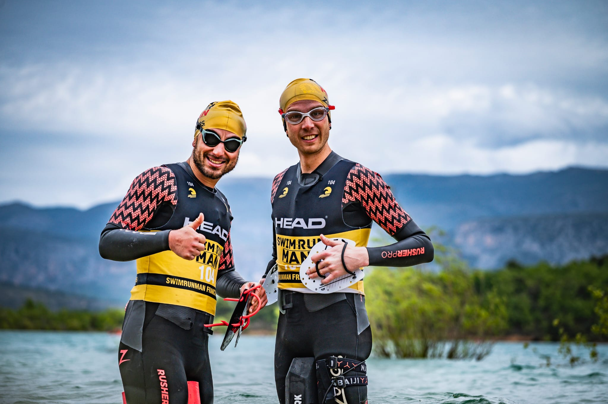

:cold_face: **Ultra Swim Run Gorges du Verdon** :cold_face:

Le swim run est un épreuve au cours de laquelle on alterne course à pieds et natation, sans jamais se changer. On nage donc avec ses chaussures et on court avec sa combinaison néoprène, avec les chaussures mouillées. C'est une course qui se fait en duo (on doit rester côte à côte du début à la fin), et j'ai eu le privilège d'avoir un binôme de choc : Toto la machine (Tomas Tessier).

Au menu 50 kilomètres de trail avec 2000 mètres de D+ et 12 kilomètres de natation, avec une eau à 14 degrés dans le lac de Sainte-Croix et 11 degrés dans les gorges, bon appétit !

Étant donné que c'est assez compliqué de s'entraîner pour du gros D+ à Nantes (faire 40 fois de suite une même côte c'est marrant une fois, mais pas quinze), je suis allé passer le mois précédant la course à Ajaccio, où Toto habite. J'y découvre le trail technique dans la caillasse et me demande comment c'est possible de courir là-dedans dans les descentes. Dès ma deuxième sortie, alors que je débranche le cerveau et commence à prendre la confiance, je suis déséquilibré et fais un beau vol plané (à l'horizontal, comme Keen V) pour atterrir dans les rochers en contrebas. Rien de grave si ce n'est une contusion au niveau des côtes (ça devient une habitude) dans le dos, qui me fera mal à chaque natation pendant 3 semaines mais qui par chance disparaîtra juste avant la course.

La température de l'eau représente la plus grosse difficulté de la course. Cela me terrorise autant que me motive. C'est d'ailleurs en partie pour cette raison que j'ai voulu m'inscrire, car je détestais l'eau froide et j'étais fasciné par les athlètes nageant en slip de bain dans de l'eau à 2 degrés. Pour se préparer à l'eau froide, il n'y a pas de secret, il faut passer un maximum de temps dedans. Pour ce faire à Nantes j'achète un mini "jacuzzi" gonflable que je mets dans ma chambre, et dans lequel je prends des bains avec des glaçons. Une fois à Ajaccio, je me baigne environ un jour sur deux dans la mer qui est à 15 degrés. Cela me permet de me familiariser avec la sensation de froid et d'apprendre à l'accepter et à me détendre malgré l'inconfort, le secret étant de réussir à respirer lentement et amplement.

Pendant les jours précédant la course, il neige sur les hauteurs du Verdon. En fondant, cette neige termine dans les gorges et refroidit considérablement l'eau, comme si elle n'était pas déjà assez froide. Elle est alors à 9 degrés dans les gorges et 10 degrés dans le lac. Pour limiter le nombre d'hypothermies et ne pas submerger ( :hand_over_mouth: ) les secours, l'organisation de la course décide de diminuer les distances. Nouveau programme : 39.2 kilomètres de trail avec 1100 mètres de D+ et 7.2 kilomètres de natation, le tout réparti en 13 sections run et 12 sections swim, les runs les plus longs étant de 10 kilomètres et les swims les plus longs 1 kilomètre.

Réveil 5h, on ouvre la fenêtre avec Toto : il pleut des cordes et il y a du vent, génial. On prend notre petit déj' et on se dit que ça y est, depuis le temps qu'on en parle et qu'on se prépare, on y est ! J'ai du mal à penser à autre chose qu'à la baignade dans l'eau froide qui nous attend. C'est très agréable d'être à 2 ensemble dans la même galère.

On arrive dans le sas un quart d'heure avant le départ. On regarde un peu comment sont équipés les autres athlètes, il y en a qui ont carrément la cagoule et les gants en néoprène. Le choix de l'équipement est assez technique, car il faut être bien à la fois dans l'eau froide mais également en courant, on ne peut donc pas trop se couvrir. Avec Toto on a opté pour un t-shirt en néoprène sous une combinaison courte pas très épaisse (pas assez !), un bandeau en néoprène sous le bonnet de bain, et des manchons en néoprène. Si c'était à refaire je m'habillerais plus chaudement, j'ai couru les 39 kilomètres de trail avec mon bonnet de bain sur la tête sans jamais ouvrir ma combi et je n'ai sué qu'une seule fois pendant quelques minutes, alors qu'en temps normal j'ai très vite chaud.

7h15 le départ est donné, c'est parti ! Je suis terrorisé à l'idée de me mettre à l'eau. Après 2 petits kilomètres, le moment fatidique arrive. Contre toute attente, cela se passe plutôt bien. Je souris en nageant et me dis que finalement ça va être une super aventure. Je galère à suivre Toto, alors qu'habituellement on nage au même rythme. Je me rends compte que dans la précipitation j'ai oublié de mettre mon pull buoy, qui est resté sur l'extérieur de ma cuisse. Le pull buoy est une sorte de petite bouée que l'on met entre les jambes et qui permet d'être plus horizontal dans l'eau sans utiliser les jambes, que l'on économise pour la course à pieds. Étant donné que la première natation ne fait que 400 mètres, tant pis je la finis comme ça.

Après un petit run de 1.6 kilomètres, c'est parti pour la deuxième natation, de 800 mètres (entre 15 et 20 minutes). J'arrive tout confiant dans l'eau, et là très mauvaise surprise : c'est horrible, le froid me fait mal aux jambes et au visage. Je nage les premières minutes le visage hors de l'eau, et je me dis qu'en fait ça va être très très long, et que ça y est le froid ne me lâchera plus jusqu'à la fin. Fin de la natation, quelqu'un est allongé par terre sous une couverture de survie. D'un côté ça fait peur mais d'un autre côté ça me fait plaisir de me dire que même si je souffre j'ai encore de la marge avant de finir sous une couverture de survie. On apprendra par la suite que 2 personnes ont perdu connaissance à cause du froid pendant la course, dont une dans l'eau (heureusement un kayak de l'organisation était là).

On enchaîne les nages et les runs et je suis frigorifié. Les runs ne sont pas longs et ne permettent pas de se réchauffer. À chaque fois c'est un supplice de se remettre à l'eau. Le mental est mis à rude épreuve, j'essaie un maximum d'observer la sensation de froid et de l'accueillir, mais j'ai surtout déjà hâte que ça se termine. Lors des natations je ne sens plus mes jambes et mes pieds et c'est dur de se remettre à courir à chaque fois. Ce qui est comique c'est qu'on a les lèvres anesthésiées par le froid et qu'on doit répéter plusieurs fois ce que l'on dit pour que l'autre nous comprenne.

Le moment tant redouté arrive : c'est l'heure de la natation de 1 kilomètre dans l'eau à 9 degrés des gorges. Il faut nager 500 mètres dans un sens (à contre-courant), puis revenir. Au bout de 2 minutes, je perds l'une de mes plaquettes (sortes de palmes de main que l'on utilise pour pousser plus d'eau et nager plus vite) : il y a un élastique qui est parti. Je suis trop deg, je suis au pire endroit où cela pouvait arriver, je suis alors immobile dans l'eau à 9 degrés, à me faire ramener par le courant, et je galère à repasser l'élastique car je ne sens plus mes doigts et je ne peux pas les serrer fort. Après avoir réussi je me force à apprécier la beauté des gorges malgré la souffrance. À la fin de ce kilomètre nous sommes super contents avec Toto car l'une des grosses difficultés de la course est passée, même si l'on sait que nous ne sommes pas au bout de nos peines.

Pendant que l'on savoure une portion de course un peu plus longue qui permet de se réchauffer, on traverse un troupeau de moutons sur un chemin et on se réjouit de l'ambiance champêtre. On se réjouit un peu moins lorsque l'on voit un patou charger le duo devant nous, puis nous attendre bien sagement au milieu du chemin en nous regardant. Pas le choix on avance, et dès que l'on se rapproche, il vient vers nous en grognant, puis une fois à 1 mètre de nous nous montre ses belles dents. On le contourne en criant dessus et en le menaçant de se prendre une bonne claque avec les plaquettes.

Toto donne le rythme, c'est le moteur de l'équipe, il est toujours devant et ne se plaint jamais. Nous retrouvons Titouan qui a fait un format plus court et a terminé. Il nous donne des indications sur les prochaines distances de run et de swim et nous rappelle de bien nous alimenter. Lorsque l'on a froid, le sucre est le meilleur carburant pour le corps pour produire de la chaleur. Nous nous forçons alors à prendre des gels régulièrement. Pendant un run je sens que j'ai sommeil, le froid draine toute mon énergie, je prends un gel cafféiné et ça passe. Pendant les parties natation, je bois l'eau du lac.

Le parcours est magnifique et offre des belles vues sur le lac. Nous sommes souvent de longues périodes sans croiser personne, c'est une course on ne peut plus nature. Nous nous rapprochons des dernières grosses portions de natation : 1 kilomètre de natation, 4 kilomètres de course puis à nouveau 1 kilomètre de natation. Ça commence à être très difficile de se réchauffer car le corps est bien fatigué. Entre ces 2 natations je tremble de tout mon corps et au ravitaillement j'alterne boire un verre de thé et m'en mettre un dans la figure. Le bénévole nous informe gentiment qu'il y en a qui tremblent encore plus que nous. Pour la première fois pendant une course je sens que je ne suis pas loin de pleurer, les nerfs sont mis à rude épreuve. Mais je suis déterminé, d'autant plus que la fin de la course se rapproche. La dernière natation est interminable, je suis gelé, j'ai du mal à avancer, mais c'est la dernière, il faut débrancher le cerveau et tenir.

Après 8h30 d'effort, nous passons la ligne d'arrivée avec beaucoup d'émotions. Puis nous courons à l'appart et nous prenons une douche brûlante, toujours avec nos combis et nos chaussures. C'est un tel bonheur. Je n'ai jamais autant souffert physiquemet et mentalement pendant une course, mais le plaisir d'avoir réussi en est d'autant plus grand. Le lendemain nous sommes dans le dur, mais c'est surtout à cause des festivités qui ont suivi la course.

:earth_asia: [Site web](https://www.swimrunman.fr/swimrun-gorges-du-verdon/) :earth_asia:

:stopwatch: [Résultats](https://chronoconsult.fr/result/swimrunmangorgesduverdon_2024/#1_BE240F) :stopwatch:

