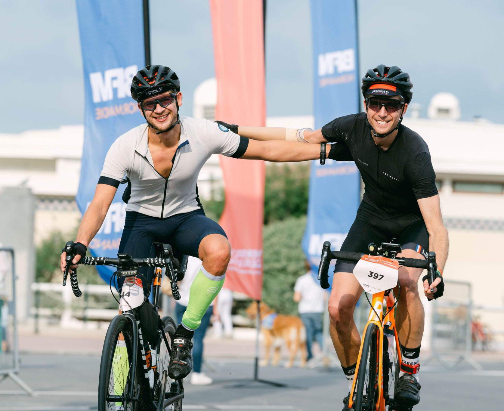

:biking_man: **Versailles -> Deauville - 255 km, 2500m D+** :biking_man:

Je m'inscris seulement quelques jours avant le départ. J'ai beaucoup hésité parce que je n'ai pas beaucoup roulé cette année et les week-ends précédant la course ont été très festifs, avec notamment le marathon du Médoc et la fête de l'huma (j'ai bu plus d'eau pendant la course que pendant ces deux week-ends réunis). Mais la tentation de participer est trop grande, pour plusieurs raisons :
- Clémence et Charlie font la course et j'ai très envie de partager ça avec eux.
- Je n'ai jamais fait une aussi grande distance et je suis curieux de voir comment je me sentirai.
- Si je ne la fais pas, Clémence va me chambrer de longs mois parce que sa plus grande distance sera plus grande que la mienne (motivation numéro un, les autres c'est pour décorer).

En m'inscrivant j'ai 3 objectifs :
1. Comme toujours : ne pas me blesser, le risque premier lorsque l'on roule en peloton étant toujours la chute.
2. Prendre du plaisir : aucun doute là-dessus.
3. Bien entendu : finir devant Clémence, je n'ai pas le choix :joy:

Le départ de la course est donné à 7h30. Chaque concurrent.e doit se placer dans un groupe avec un meneur d'allure et une moto sécurité. Après pas mal d'hésitation, avec Charlie nous nous mettons dans le groupe 29 km/h. Nous n'avons jamais roulé aussi longtemps et nous préférons jouer la sécurité, quitte à accélérer un peu à la fin s'il nous en reste sous la pédale. Clémence se met dans le groupe 28 km/h.

C'est parti pour une longue journée à sillonner les routes de campagne. La première heure, je suis choqué en voyant le nombre de personnes arrêtées sur le bord de la route en train de réparer leur pneu qui a crevé, je commence à me dire que je vais forcément devoir y passer moi aussi. Le rythme est très confortable et on papote avec Charlie. Il faut savoir qu'habituellement on adore se tirer la bourre et prendre des gros relais : l'un est devant et bombarde pendant que l'autre est dans sa roue, et on alterne. On a peur que la course soit un peu ennuyeuse, étant donné que c'est un effort assez lisse et pas très intense, mais il reste plus de 200 kilomètres alors pour le moment on attend de voir venir (c'est à la fin du bal qu'on paie les musiciens).

Grosse envie de pipi pour tous les deux, on décide de prendre un peu d'avance sur le groupe pour faire notre petite affaire. Quelques secondes après être descendus du vélo, le groupe nous passe déjà. On hallucine, en fait une bonne avance en distance ne réprésente que quelques secondes en temps. Il faut maintenant bombarder pour rattraper le groupe, mais on adore ça, et on s'en donne à coeur joie. Une fois le groupe retrouvé, sous le coup de l'excitation, nous le dépassons et nous partons devant avec quelques coureurs, on prend tous des relais et on se régale, mais on se dit quand même qu'on est hyper débiles, la course est encore longue et on ferait mieux de s'économiser, alors on attend le groupe.

Il y a des grandes descentes sinueuses sur route mouillée, ma hantise (je suis devenu sage). Nous rattrapons des mecs des groupes de devant avec les coudes en sang, il y a eu une grosse chute avec 30 coureurs dedans. Puis j'apprends via mon tel que Clémence a chuté également (rien de grave), et que sa pote en voulant l'éviter a chuté et s'est possiblement cassé la clavicule, fin de la course pour elle.

Il y a 3 ravitos pendant la course. À chaque fois j'ai le même rituel : petit pipi, refaire le plein de barres énergétiques, remplir ma gourde de boisson isotonique et avaler tout ce que je peux pendant ce temps (surtout des TUC, important pour le sel). Une bonne nutrition est primordiale pour une épreuve de longue distance et je me force à manger au moins 2 barres par heure, même si je n'ai pas faim.

Le ravito du kilomètre 100 se fait à Vernon, sur un spot magnifique au bord de la Seine. En repartant, ça bouchonne fort à cause des voitures dans la ville et j'entends beaucoup de coureurs râler parce que cela fait chuter leur vitesse moyenne. Je me marre parce que je n'ai même pas de compteur et cela me fait de belles jambes.

Vers le 130ème kilomètre, je vois une fontaine de liquide blanc devant moi dans le peloton, quelqu'un qui roule en tubeless vient de crever. Je me marre en voyant tout le monde esquiver pour ne pas prendre une petite douche, puis je vois que c'est la roue de Charlie, mince ! On s'arrête un peu plus loin pour regonfler, mais grosse galère, le pneu est bien entaillé et aussitôt qu'il met plus de 4 bars ça regicle (et il s'en prend plein la figure, c'est très dur de ne pas exploser de rire, mais il est déjà tendu comme une crampe). Le groupe 28 km/h nous dépasse (Clémence qui a chuté est maintenant dans un groupe plus lent). On repart comme ça mais le pauvre n'a que 3 bars dans son pneu arrière, contre 7 habituellement, ce qui rend le pédalage bien plus difficile.

On prend des relais pour rattraper le groupe et on débat sur la meilleure chose à faire pour son pneu. Je vous passe les détails techniques mais il décide de rester comme ça jusqu'à l'arrivée. Avec cette petite mésaventure le temps passe vite et nous arrivons déjà au ravito du kilomètre 160. C'est bien la première fois que l'on me dit : "plus que 100 kilomètres".

Mes jambes sont encore bonnes et je n'ai aucun doute que cela va bien se passer jusqu'à l'arrivée, je savoure, d'autant plus que le soleil est maintenant au rendez-vous. Par contre la position plié en 4 sur le vélo commence à être vraiment inconfortable et difficile à tenir, ça tire pas mal dans le cou, le dos, les épaules etc., je n'arrête pas de changer de position mais rien n'y fait. Je repense alors à ce qu'un marathonien très chaud a dit dans un podcast : "lorsque je souffre, j'imagine comment cela pourrait être encore pire, et je me sens mieux". Je l'applique et ça fonctionne !

Lorsque l'on repart du ravito du kilomètre 200, grosse joie : plus que 55 kilomètres ! Sauf qu'il reste 1100 mètres de d+, ce qui est énorme sur une si courte distance. Ce n'est pas de la montagne mais ça vous gagne quand même. Ayant plutôt un profil de grimpeur, je suis le premier du groupe en haut de chaque côte, ce qui déjà fait du bien au moral, mais surtout cela me permet de prendre mon temps dans les descentes et de ne pas prendre de risque. On enchaîne les gros pétards et le groupe explose. On se retrouve assez rapidement à deux avec Charlie et on finira comme ça. Les 15 derniers kilomètres étant assez plats et nos jambes encore assez bonnes, on se fait plaisir et on bombarde.

Nous franchissons la ligne d'arrivée après 9h22 d'effort (dont une heure d'arrêt au total).

Un grand bravo à Charlie pour avoir roulé 130 kilomètres avec un pneu gonflé à 3 bars, c'est vraiment une machine. Et un grand bravo à Clémence pour être allée au bout malgré sa chute, trop fier de ma petite soeur !

:earth_asia: [Site web](https://versaillesdeauville.com/) :earth_asia:

:stopwatch: [Résultats](https://live.breizhchrono.com/external/live5/index.jsp?reference=1488071608761-634) :stopwatch:

